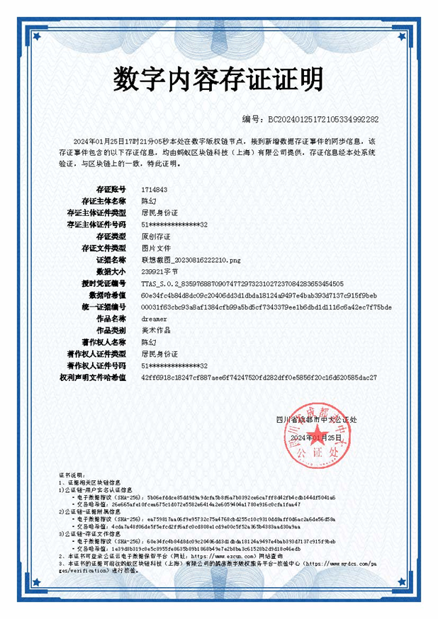

# 0 阶段

实现基于区块链的证据存储系统，支持以下功能：    

- 存储证据
- 验证证据

在存储证据时，支持用户上传源文件、文件的哈希值，并生成存证证明。存证证明包含文件的哈希值、文件的元数据、存证时间、存证人、区块高度、交易哈希值等。存证证明可以用于验证文件的完整性、来源和时间。如下图所示：

    

在验证证据时，用户可以上传存证证明，并根据存证证明中的哈希值、文件的元数据、存证时间、存证人、区块高度、交易哈希值等信息，验证文件的完整性、来源和时间。

如果存证证明中的哈希值与文件的哈希值不一致，说明文件被篡改，验证失败。

## 0.1 需求分析

### 存证证书生成与分发

存证证书生成：

- 存证成功后，系统自动生成PDF格式的电子证书
    + AC1: 证书包含内容哈希、TxID、时间戳、区块链浏览器链接
    + AC2: 附加司法鉴定机构电子签名和盖章

- 存证证书分发：
    + 系统自动将存证证书发送给存证人
    + 存证人可以通过下载文件等方式获取存证证书

## 0.2 设计

## 0.3 编码

## 0.4 测试

## 0.5 部署