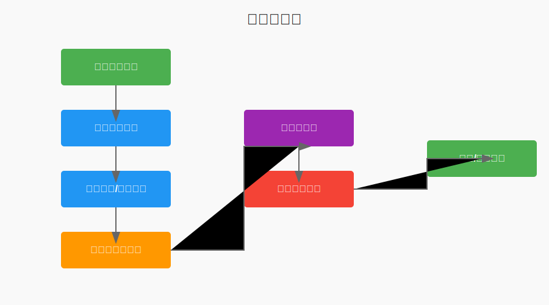
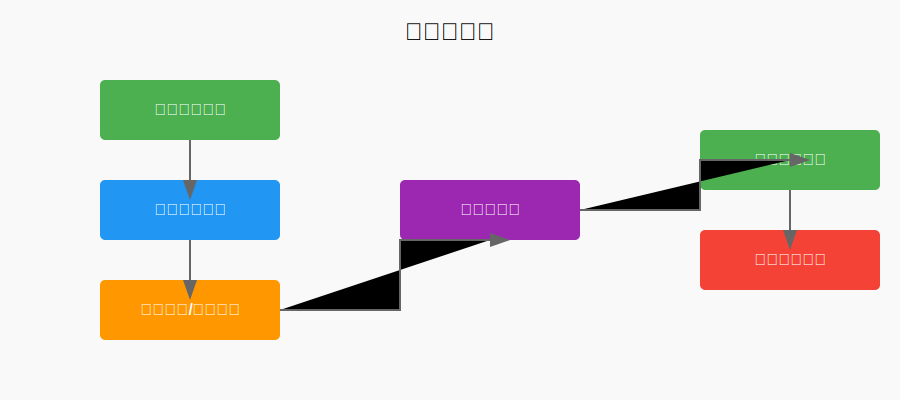
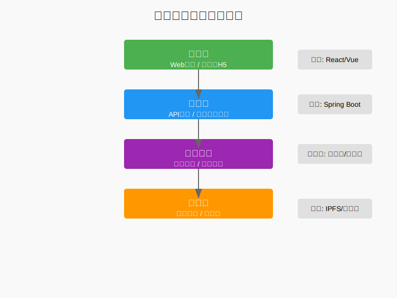

# 区块链存证系统需求文档

## 1. 项目概述

### 1.1 项目背景

随着数字化转型加速，电子数据的法律效力和安全性越来越受到关注。传统的中心化存证方式存在易篡改、可信度低等问题。区块链技术凭借其去中心化、不可篡改、可追溯的特性，为电子数据存证提供了理想的解决方案。

### 1.2 项目目标

开发一个基于区块链的存证系统，支持文件和文件哈希的上传存证，生成具有法律效力的存证证明，并提供便捷的证据验证功能，为用户提供安全、可信、高效的电子数据存证服务。

### 1.3 核心价值

- **可信存证**：利用区块链不可篡改特性确保数据真实性
- **高效便捷**：简化存证流程，降低存证成本
- **法律效力**：提供符合法律要求的存证证明
- **隐私保护**：支持文件哈希存证，保护原始数据隐私

## 2. 用户角色与场景

### 2.1 用户角色

| 角色     | 描述                       | 核心需求                                           |
| -------- | -------------------------- | -------------------------------------------------- |
| 普通用户 | 需存证电子数据的个人或企业 | 简单易用的存证流程，可靠的存证证明，便捷的验证方式 |
| 管理员   | 系统维护和管理角色         | 系统监控，用户管理，数据统计                       |
| 验证方   | 需要验证存证数据的第三方   | 快速验证存证数据的真实性和有效性                   |

### 2.2 典型场景

1. **个人文件存证**：用户上传重要合同、知识产权文档等进行存证
2. **企业数据存证**：企业上传财务数据、交易记录等进行存证
3. **电子证据验证**：法院、仲裁机构等验证存证数据的真实性

## 3. 功能需求

### 3.1 核心功能模块

#### 3.1.1 用户管理模块

- 用户注册/登录
- 个人信息管理
- 权限管理

#### 3.1.2 存证管理模块

- 文件上传存证
- 文件哈希上传存证
- 存证记录查询
- 存证证明生成

#### 3.1.3 验证模块

- 存证数据验证
- 存证证明验证
- 验证结果导出

#### 3.1.4 系统管理模块

- 系统监控
- 日志管理
- 数据统计分析

### 3.2 详细功能描述

#### 3.2.1 文件上传存证

- 支持多种文件格式上传（PDF、DOC、JPG、PNG 等）
- 文件大小限制：单次上传不超过 100MB
- 上传进度显示
- 文件元数据自动提取（创建时间、修改时间、大小等）
- 自动计算文件哈希值
- 支持批量上传

#### 3.2.2 文件哈希上传存证

- 支持手动输入文件哈希值
- 支持主流哈希算法（SHA256、MD5 等）
- 哈希值格式验证
- 相关元数据录入（文件名、描述等）

#### 3.2.3 存证证明生成

- 自动生成标准化存证证明
- 包含存证时间、存证主体、文件信息、哈希值、区块链交易 ID 等信息
- 支持 PDF 格式导出
- 支持电子签名

#### 3.2.4 存证验证

- 支持通过存证编号验证
- 支持通过文件哈希验证
- 支持上传文件进行验证
- 验证结果清晰展示（是否有效、存证时间等）
- 验证报告生成与导出

## 4. 非功能需求

### 4.1 性能要求

- 存证处理时间：单个文件存证不超过 5 秒
- 验证响应时间：不超过 2 秒
- 系统并发处理能力：支持 1000 用户同时在线操作

### 4.2 安全性要求

- 用户数据加密存储
- 传输过程加密（HTTPS）
- 区块链私钥安全管理
- 防 DDoS 攻击
- 数据备份与恢复机制

### 4.3 可靠性要求

- 系统可用性：≥99.9%
- 数据持久性：≥99.999%
- 故障恢复时间：≤30 分钟

### 4.4 兼容性要求

- 支持主流浏览器（Chrome、Firefox、Safari、Edge）
- 支持 Windows、MacOS、Linux 操作系统
- 移动端适配

## 5. 业务流程

### 5.1 存证流程

1. 用户登录系统
2. 选择存证方式（文件上传或哈希上传）
3. 上传文件或输入哈希值及相关信息
4. 系统计算哈希值（文件上传方式）并验证
5. 系统将哈希值及元数据写入区块链
6. 生成存证证明
7. 用户查看或下载存证证明



### 5.2 验证流程

1. 用户/验证方进入验证页面
2. 选择验证方式（存证编号、哈希值或文件上传）
3. 输入验证信息或上传文件
4. 系统查询区块链数据
5. 返回验证结果
6. 生成验证报告（可选）



## 6. 系统架构

### 6.1 总体架构

- 前端层：Web 界面
- 后端层：API 服务、业务逻辑处理
- 区块链层：智能合约、节点交互
- 存储层：文件存储、数据库



### 6.2 技术栈

- 前端：Next.js
- 后端：Java Spring Boot
- 区块链：以太坊/联盟链
- 数据库：MySQL、Sqlite
- 文件存储：本地文件系统存储

## 7. 数据结构定义

### 7.1 存证数据结构

```json
{
  "evidenceId": "string", // 存证编号
  "userId": "string", // 用户ID
  "fileName": "string", // 文件名
  "fileSize": "number", // 文件大小
  "fileType": "string", // 文件类型
  "hashValue": "string", // 文件哈希值
  "hashAlgorithm": "string", // 哈希算法
  "metadata": { "key": "value" }, // 元数据
  "timestamp": "number", // 存证时间戳
  "blockchainTxId": "string", // 区块链交易ID
  "status": "string" // 存证状态
}
```

### 7.2 存证证明数据结构

```json
{
  "certificateId": "string", // 证明编号
  "evidenceId": "string", // 关联存证编号
  "userId": "string", // 用户ID
  "userName": "string", // 用户名
  "hashValue": "string", // 文件哈希值
  "timestamp": "number", // 存证时间戳
  "blockchainInfo": {
    "chainName": "string", // 区块链名称
    "txId": "string", // 交易ID
    "blockHeight": "number" // 区块高度
  },
  "signature": "string", // 电子签名
  "issuedDate": "number" // 证明生成时间
}
```

## 8. 验收标准

### 8.1 功能验收

- 所有核心功能按照需求描述正常工作
- 存证数据成功写入区块链
- 存证证明正确生成并可验证
- 系统各模块之间交互正常

### 8.2 性能验收

- 存证处理时间 ≤5 秒
- 验证响应时间 ≤2 秒
- 系统并发处理能力 ≥1000 用户

### 8.3 安全性验收

- 通过第三方安全测试
- 数据加密存储和传输
- 无敏感信息泄露

## 9. 项目计划

### 9.1 里程碑

- 需求分析与设计：2 周
- 核心功能开发：4 周
- 测试与优化：2 周
- 部署与上线：1 周

### 9.2 交付物

- 需求文档
- 设计文档
- 源代码
- 测试报告
- 部署文档
- 用户手册
